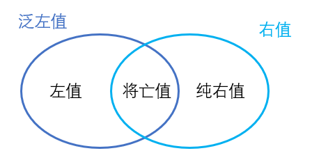

## 一.值的分类
### 传统分类
1.	**左值 lvalue (位置值)** 存储数据值的内存位置。可以取地址。
2.	**右值 rvalue (被读取的值)** 它的数据值，存储在某个内存地址中。不可取地址。

### \[11+\][$]新标准分类
+ 	**拥有身份** 可以确定表达式与另一表达式是否指代同一实体（是否有相同的内存位置）。
	
	>例如 表达式 `5;` 和另一处的表达式 `5;` 是否是相同的内存位置是不确定的。因为表达式结束后，它的生命期就结束了。下一次它被分配在什么内存位置也不确定，也许是上次分配的位置，也许是另外的位置。
	>例如 对于一个局部变量(没有重名的其他域的变量)，可以确定其内存位置。


+	**可被移动** 可以被用作移动构造函数、移动赋值运算符等的参数。


1.	`lvalue` 左值，位置值，之前的 `lvalue` 。
	+	拥有身份。
	+	可以取地址。
	+	不可被移动。
2.	`xvalue` *expiring value* 将亡值。
	+	拥有身份。
	+	不可以取地址。
	+	可被移动。
3.	`glvalue` *generalized lvalue* 泛左值，包含左值和将亡值。
	+	拥有身份。
4.	`rvalue` 右值，被读取的值，包含纯右值和亡值。不可以取地址。
	+	可被移动。
5.	`prvalue` *pure rvalue* 纯右值，之前的 `rvalue` 。
	+	没有身份。
	+	不可以取地址。
	+	可被移动。



## 二.表达式中的左右值
1.	赋值运算符的需要一个 **左值** 作为其左侧运算对象，得到的结果也仍然是一个 **左值** 。
2.	取地址运算符作用于一个 **左值** 对象，返回一个指向该运算对象的指针，这个指针是一个 **右值** 。
3.	解引用运算符和下标访问运算符的求值结果都是 **左值** 。
4.	递增和递减运算符作用于一个 **左值** 对象，其前置版本(++i)得到的结果也是 **左值** ,而后置版本(i++)得到的是 **右值** 。
```c++
int i = 2;
cout << &++i <<endl;//OK
cout << &i++ <<endl;//WRONG
```

5.	字符串字面量是 **左值** 。

## \[11+\][$]三.std::move(exp)
1.	**用途** 强行将左值转换为右值引用，这样创建一个新对象的时候，可以调用移动构造函数，而不是拷贝构造函数，减小内存开销。

