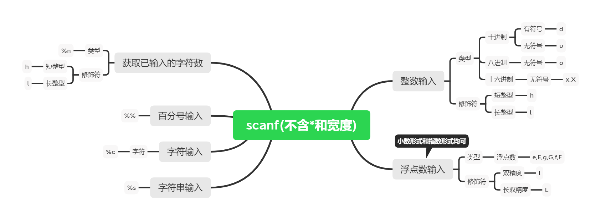
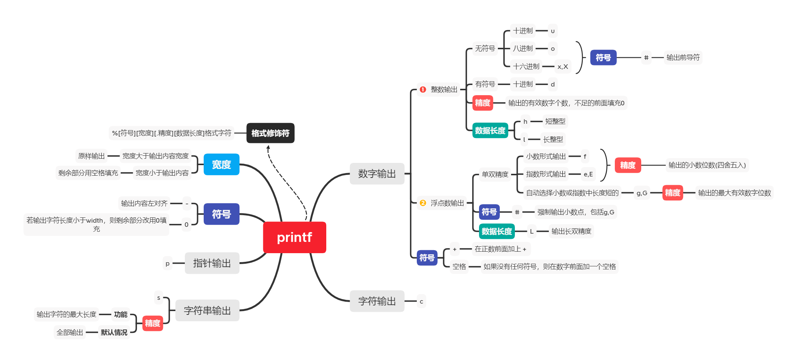

>[danger] 需要引入 `cstdio` 或 `stdio.h`

## 一.格式化输入
1.	函数简介

|  函数     | **int** scanf(**const char\*** format,...)                   |
|  ---------- | ------------------------------------------------------------ |
|  **功能**   | 从标准输入(stdin)读取格式化输入。若输入缓冲区中没有字符，则从系统隐含指定的输入设备(键盘)中输入一个字符。若输入缓冲区中有字符，则不从缓冲区中读取字符。 |
|  **参数**   | **const char** *format  格式化输入字符串。格式转换说明符以外的字符需要按原样输入。两个数之间若无其他字符则可以通过输入空格字符（空格字符可以是空白、换行和制表符）隔开。 |
|  **参数** | **…**  变量 **地址表**                                            |
|  **返回值** | **int** 成功匹配和赋值的个数。如果到达文件末尾或发生读错误，则返回 EOF。                  |

2.	格式转换说明符 `%[*][width][modifiers]type`

|  **参数**      | **描述**                                                     |
|  ------------- | ------------------------------------------------------------ |
| **\***   忽略输入 | 这是一个可选的星号，表示数据是从流 stream 中读取的，但是可以被忽视，即它不存储在对应的参数中。 |
| **width** 宽度  | 这指定了在当前读取操作中读取的最大字符数。                   |
| **modifiers** 修饰符| 为对应的附加参数所指向的数据指定一个不同于整型（针对 d、i 和 n）、无符号整型（针对 o、u 和 x）或浮点型（针对 e、f 和 g）的大小： |
|  **type** 类型|指定了要被读取的数据类型以及数据读取方式。|

>[warning]不支持设置精度



3.	百分号输入	`%%`

4.	字符输入
	+	字符 	`%c`
	
>[warning]%c只会读取一个字符，在输入结束时，后面不要加空白字符。
```c++
char type,confirm;
scanf("%c %c",&type,&confirm);
printf("%c,%c",type,confirm);
```

>执行情况1
>BY [回车]
>B,Y

>执行情况2
>B Y [回车]
>B, 


>[success]若`scanf` 以 `%c` 开头，最好在 `%c` 前面加入一个空格，防止程序绕过输入，直接读取缓冲区中的 `\n`
```c++
char type,confirm;
scanf("%c",&type);
scanf("%c",&confirm);
printf("%c,%c",type,confirm);
```
>结果
>B [回车]
>Y [回车]
>B,
>

```c++
char type,confirm;
scanf(" %c",&type);
scanf(" %c",&confirm);
printf("%c,%c",type,confirm);
```
>结果
>B [回车]
>Y [回车]
>B,Y


5.	浮点数输入：小数形式和指数形式均可
	+	类型
		+	浮点数 	`e,E,g,G,f,F`
	+	修饰符
		+	双精度 	`l`
		+	长双精度 	`L`
6.	字符串输入	`%s`
	
>[primary]遇到空白字符或到达 `width` 长度(不含'\0')后字符串输入停止。

7.	整数输入
	+	类型
		+	十进制
			+	有符号	`d`
			+	无符号	`u`
		+	八进制
			+	无符号 `o`
		+	十六进制
			+	无符号	`x,X`
	+	修饰符
		+	短整型	`h`
		+	长整型	`l`

8.	获取已输入的字符数
	+	类型	`%n`
	+	修饰符
		+	短整型	`h`
		长整型	`l`


## 二.格式化输出



1.	函数概览

| **函数**   | **int** printf(**const char\*** format,...)                  |
| ---------- | ------------------------------------------------------------ |
| **功能**   | 从标准输入(stdout)读取格式化输入。若输入缓冲区中没有字符，则从系统隐含指定的输入设备(键盘)中输入一个字符。若输入缓冲区中有字符，则不从缓冲区中读取字符。 |
| **参数**   | **const char** *format   格式化输出字符串。                  |
| **参数**   | ... 变量表                                                   |
| **返回值** | **int**  如果成功，则返回写入的字符总数，否则返回一个负数。  |

2.	格式修饰符 `%[flags][width][.precision][length]specifier`
	+	**flags** 标识
		+	**-** 在给定的字段宽度内左对齐，**默认是右对齐**。
		+	**+** 在正数前面加上+。 
		+	**空格** 如果没有任何符号，则在值前面插入一个空格。
		+	**#** 
			+	与 o、x 或 X 说明符一起使用时，非零值前面会分别显示 0、0x 或 0X。  
			+	与 e、E 和 f 一起使用时，会强制输出包含一个小数点，即使后边没有数字时也会显示小数点。默认情况下，如果小数点后边没有数字时候，不会显示显示小数点。  
			+	与 g 或 G 一起使用时，结果与使用  e 或 E 时相同，但是尾部的零不会被移除。
		+	**0** 当指定width且输出的值短于该数时，**左边的剩余部分会填充0，而不是空格**。
	+	**width** 要输出的字符的最小数目。如果输出的值短于该数，剩余部分会用空格填充。如果输出的值长于该数，结果不会被截断。
	+	**.precision** 
		+	对于整数说明符（d、i、o、u、x、X）：precision 指定了要写入的数字的最小位数。
			+	如果写入的值短于该数，**结果会用零来填充**。
			+	如果写入的值长于该数，结果不会被截断。
			+	精度为 0 意味着不写入任何字符。
		+	对于 e、E 和 f 说明符：要在小数点后输出的小数位数（**会四舍五入**）。 
		+	 对于 g 和 G 说明符：要输出的最大有效位数。 
		+	  对于 s: 要输出的最大字符数。默认情况下，所有字符都会被输出，直到遇到末尾的空字符。**当未指定任何精度时，默认为 1。**
+	**length** 
		+	h     参数被解释为短整型或无符号短整型（仅适用于整数说明符：i、d、o、u、x 和 X）。 
		+	L     参数被解释为长双精度型（仅适用于浮点数说明符：e、E、f、g 和 G）。
		+	l	  参数被解释为长整型或无符号长整型，适用于整数说明符（i、d、o、u、x 和 X）及说明符 c（表示一个宽字符）和 s（表示宽字符字符串）。
+	**specifier** 格式字符
|  **格式字符** | **意义**                                                     |
|  ------------ | ------------------------------------------------------------ |
|  **d**        | 以十进制形式输出带符号整数(正数不输出符号)                   |
|  **o**        | 以八进制形式输出无符号整数(不输出前缀0)                      |
|  **x,X**      | 以十六进制形式输出无符号整数(不输出前缀0x)                   |
|  **u**        | 以十进制形式输出无符号整数                                   |
|  **f**        | 以小数形式输出单、双精度实数                                 |
|  **e,E**      | 以指数形式输出单、双精度实数                                 |
|  **g,G**      | 以%f或%e中较短的输出宽度输出单、双精度实数，且不输出无意义的0 |
|  **c**        | 输出单个字符                                                 |
|  **s**        | 输出字符串                                                   |
|  **p**        | 输出指针地址                                                 |

