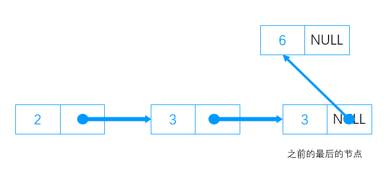
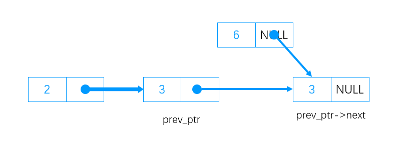

## 一.概述

1. **概念** 链表是一种物理存储单元上非连续、非顺序的存储结构，数据元素的逻辑顺序是通过链表中的指针链接次序实现的。
    与数组不同，我们无法在一次性访问单链表中的随机元素。 如果我们想要获得第 i 个元素，我们必须从头结点（或尾节点）逐个遍历。
2. **类型**
    * 单向链表
        
    * 双向链表
        

## 二.单向链表

### （一）节点结构

```c++
struct Node {
	int data;
	Node* next;
};
```

* `data` 是需要存放的数据
* `next` 是下一个节点的地址

### （二）类的基本结构

这个结构只包含一个简单的构造函数、获取长度的函数和私有成员

```c++
class SingleLinkedList {
private:
	//节点
	struct Node {
		int data;
		Node* next;
	};
	//梦开始的地方~~
	Node* start_;
	//链表的长度，为避免length_被外部修改，放私有了
	int length_;
public:
	//简单的构造函数
	SingleLinkedList()
	{
		length_ = 0;
		start_ = NULL;
	}
	//获取长度
	int Length()
	{
		return length_;
	}
};
```

### （三）创建空节点

使用动态内存创建一个空的节点，不过这个时候节点没有链接到链表。

```c++
Node* CreateNode(int data)
{
	Node* current = new Node;//动态创建
	current->next = NULL;//将指针设置为空
	current->data = data;//设置数据
    return current;
}
```

### (四) 添加节点到单链表

1. 无论遇到什么情况，都不要怕，先创建一个空节点 `new_node` 再说。
2. 在空链表上添加节点
    1. 直接把空节点 `new_node` 的地址赋给 `start_` 成员即可。
3. 在链表末尾上添加节点
    1. 遍历到最后一个节点。
    2. 让最后一个节点的 `next` 指向空节点。
        
4. 在中间加节点
    1. 遍历到上一个节点 `prev_ptr` ，即插入点之前的节点。
    2. 让空节点 `new_node` 的 `next` 指向上一个节点 `prev_ptr` 的 `next` 。
        
    3. 让上一个节点 `prev_ptr`  的 `next` 指向空节点 `new_node` 。
        