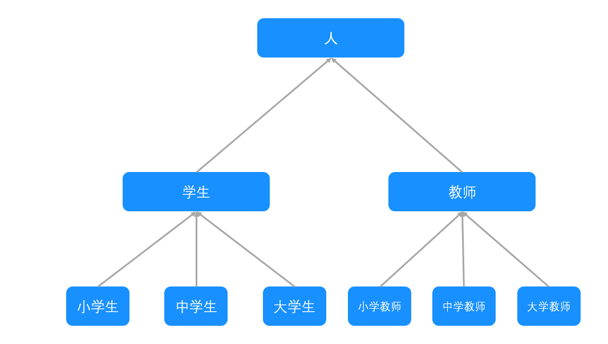
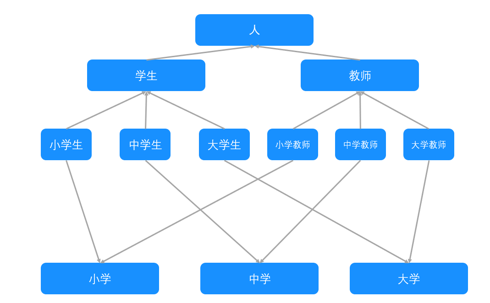
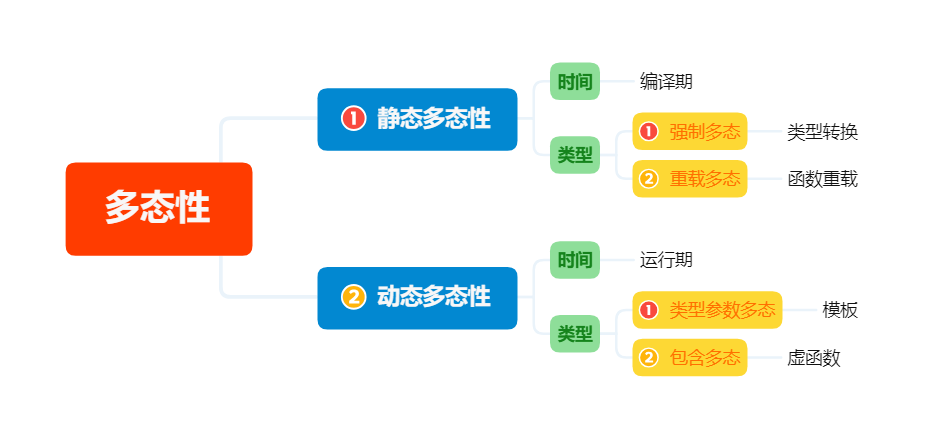

## 一.继承和派生
1.	**继承** 在一个已存在的类的基础上建立一个新的类。
2.	**基类** / **父类** 已存在的类。
3.	**派生类** / **子类** 新建立的类。
4.	**直接基类/直接派生类** 两个类在继承关系中是相邻的。
5.	**间接基类/间接派生类** 两个类在继承关系中是不相邻的。其中间接基类也称为祖先类，间接派生类也称为子孙类。
6.	**单继承** 一个派生类只从一个基类派生。
#### 例1 单继承关系

大学生是学生的直接派生类，学生是大学生的直接基类，人是大学生的间接基类。

7.	**多重继承** 一个派生类有两个或多个基类。
	多重继承可以反映现实生活中的情况，能够有效地处理一些较复杂的问题，使编写程序具有灵活性，但是多重继承也引起了一些值得注意的问题，它增加了程序的复杂度，使程序的编写和维护变得相对困难，容易出错。最主要的问题是 **二义性问题** 。
#### 例2 多重继承关系
在下面的图中，小学生、中学生、大学生、小学教师、中学教师、大学教师采用了多重继承关系。

8. **基类和派生类的关系**  派生类是基类的具体化，而基类则是派生类的抽象。

9. 继承与组合
	+	继承是垂直的，组合（即聚集）是水平的。
	+	二者都是为了在某种程度上实现软件复用，即共享。

## 二.多态性
1.	**概念** 多态性是指具有不同功能的函数可以用同一个函数名，这样就可以用一个函数名调用不同内容的函数。
	向不同的对象发送同一个消息，不同的对象在接收时会产生不同的行为(即方法)。也就是说，每个对象可以用自己的方式去响应共同的消息。
2.	多态性的分类

3.	**匹配** 把函数的调用表达式与函数的定义表达式进行绑定。
4.	**静态多态性** 采用 **静态联编（或静态匹配、静态映射、静态绑定、先期联编）技术** ，是指在 **程序编译阶段** 就可确定的多态性，又称为编译时的多态性。它有两种实现形式： **强制多态** 和 **重载多态** 。
5.	**强制多态** 通过隐式或显式的类型转换来实现的多态性。将一种类型的值强制转换成为另一种类型的值称为 **类型强制** ,即 **强制多态** 。
6.	**重载多态** 通过函数和运算符重载来实现的多态性。重载实际上是给程序正文中相同作用域内的的同一个标识符赋予不同的操作语义。
7.	**动态多态性** 动态多态性采用 **动态联编技术（或动态匹配、动态映射、动态绑定、滞后联编）** ，是指在 **程序运行阶段** 才能确定的多态性，又称为运行时的多态性。它有两种实现形式：**类型参数多态** 和 **包含多态** 。
8.	**类型参数多态** 通过函数模板或类模板实现的多态性。
9.	**包含多态** 通过 **虚函数** 实现的多态性。

