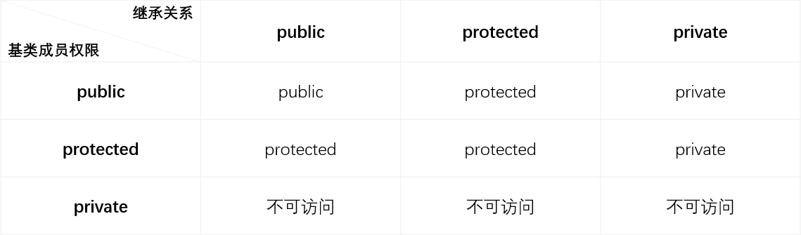

## 一.派生类的声明
```c++
class 类名 : 继承方式 基类名,... {};
```
其中，继承方式为 `public` `private` `protected`。
对于`class` 声明的类，继承方式默认为 `private`。
对于`struct` 声明的类，继承方式默认为 `public`。

## 二.派生类的构成
派生类中的成员包括从基类继承过来的成员和自己增加的成员两大部分。每一部分均分别包括数据成员和成员函数。
### 1.构造函数与析构函数
+	**构造函数和析构函数不能从基类继承**。
+	派生类可以访问基类的构造函数，来完成从基类继承的数据成员的初始化。	
	
	>[warning] 派生类构造次序：基类构造函数 --> 对象成员构造函数 --> 派生类构造函数 （与虚拟继承无关）
+	派生类不能访问基类的析构函数，但是派生类对象析构时，编译器 **先执行派生类的析构函数，再执行基类的析构函数** 。

### 2.派生类的存储结构
>这些结论可能因编译器而异。

1.	继承自基类的数据成员的相对地址在前面，新增的数据成员的相对地址在后面。
2.	对于 **多重继承** ，每个基类数据成员的整体位置取决于派生类声明时基类的顺序。
3.	对于 **虚拟继承**，虚基类会按照声明顺序分布在最派生类的末尾。
4.	对于 **多态基类** (有虚函数的基类) ，则会按照声明顺序分布在派生类的起始位置。而非多态基类则分布在多态基类的后面。
5.	每个多态基类和虚基类的直接派生类有一个额外指针。

### 3.特殊内容的继承
1.	**静态成员的继承** 如果基类定义了一个静态成员，则在整个继承体系中只存在该成员的唯一定义。 即所有的派生类共用基类的静态成员。
2.	**友元关系不能传递，也不能继承**。基类的友元在访问派生类成员时不具有特殊性，类似的，派生类的友元也不能随意访问基类的成员。


#### 例1 
下面是派生类 `Student` 与基类 `People` 的构成：


## 三.基类成员在派生类的访问权限



+	派生类和基类是两个作用域。
+	派生类的成员函数访问基类的成员时，访问权限按照上表进行变化。
+	基类的成员函数访问基类的成员时，访问权限不发生变化。

