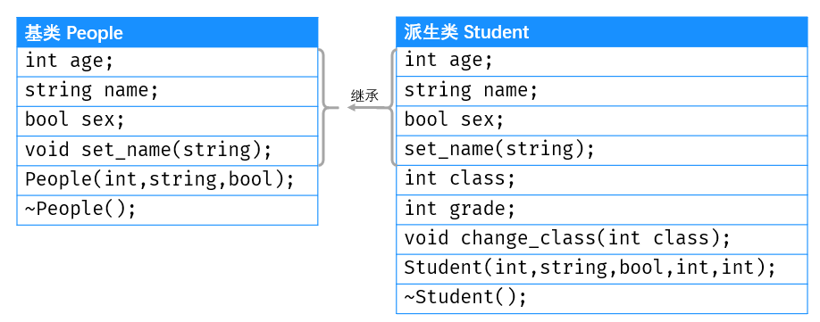

## 一.继承和派生的概念
1.	**继承** 在一个已存在的类的基础上建立一个新的类。
2.	**基类** / **父类** 已存在的类。
3.	**派生类** / **子类** 新建立的类。
4.	**直接基类/直接派生类** 两个类在继承关系中是相邻的。
5.	**间接基类/间接派生类** 两个类在继承关系中是不相邻的。其中间接基类也称为祖先类，间接派生类也称为子孙类。
6.	**单继承** 一个派生类只从一个基类派生。
#### 例1 单继承关系

大学生是学生的直接派生类，学生是大学生的直接基类，人是大学生的间接基类。

7.	**多重继承** 一个派生类有两个或多个基类。
#### 例2 多重继承关系
在下面的图中，小学生、中学生、大学生、小学教师、中学教师、大学教师采用了多重继承关系。


8.	**基类和派生类的关系**  派生类是基类的具体化，而基类则是派生类的抽象。

## 二.派生类的声明
```c++
class 类名 : 继承方式 基类名,... {};
```
其中，继承方式为 `public` `private` `protected`，默认为 `private`。

## 三.派生类的构成
+	派生类中的成员包括从基类继承过来的成员和自己增加的成员两大部分。每一部分均分别包括数据成员和成员函数。
+	构造函数和析构函数不能从基类继承。
+	继承自基类的数据成员的相对地址在前面，新增的数据成员的相对地址在后面。

#### 例3 
下面是派生类 `Student` 的与基类 `People` 的构成：


