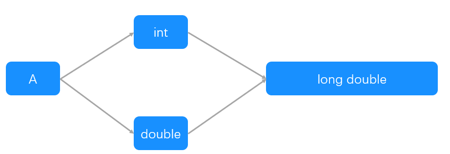
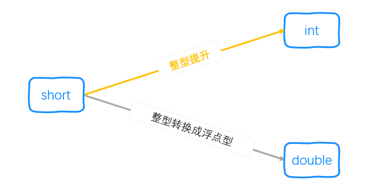
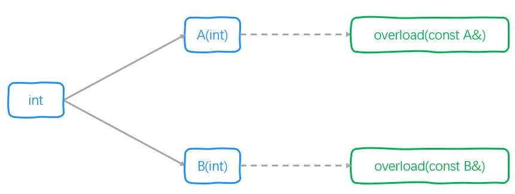
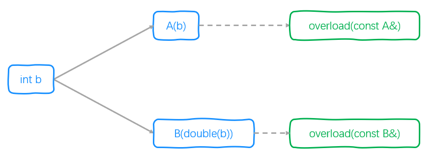
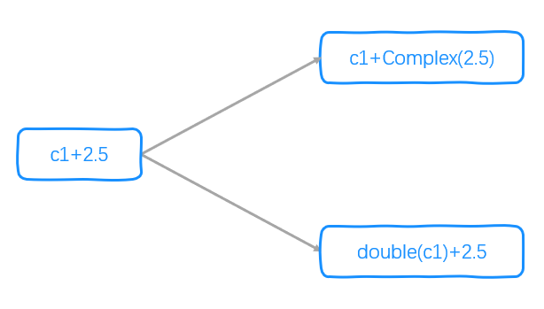

## 一.转换函数的类型
1.	转换构造函数：从其他类型到类类型 `T`
2.	类型转换函数：从类类型 `T` 到其他类型

## 二.转换构造函数
### 1.工作
它的主要工作是构造对象，顺带完成类型转换工作。
### 2.调用方式
**既可以被编译器自动调用，也可以被用户强制调用。**

### 3.定义和声明
+	转换构造函数是构造函数中的一种，其定义和声明与构造函数是一样的。
+	转换构造函数在调用时只会传入一个参数，因此应该保证 **转换构造函数至少有一个形参，且最多只有一个形参没有默认参数** 。

#### 例1
下面是一个带有转换构造函数的类 `Complex` 。
```c++
class Complex
{
private:
    double real_;
    double imaginary_;

public:
    Complex() : real_(0), imaginary_(0)
    {
    }
    //转换构造函数
    Complex(double real) : real_(real), imaginary_(0)
    {
    }
    Complex(double real, double imaginary) : real_(real), imaginary_(imaginary)
    {
    }
    Complex &set_real(double new_val)
    {
        this->real_ = new_val;
        return *this;
    }
    Complex &set_imaginary(double new_val)
    {
        this->imaginary_ = new_val;
        return *this;
    }

};
```
然后，就可以这么创建对象：
```c
Complex a,b = 6,c(6,5);
```
接下来，我们来简化构造函数：
```c++
class Complex
{
private:
    double real_;
    double imaginary_;

public:
    Complex() : real_(0), imaginary_(0)
    {
    }
    //既是转换构造函数，也是普通构造函数
    Complex(double real, double imaginary = 0) : real_(real), imaginary_(imaginary)
    {
    }
    Complex &set_real(double new_val)
    {
        this->real_ = new_val;
        return *this;
    }
    Complex &set_imaginary(double new_val)
    {
        this->imaginary_ = new_val;
        return *this;
    }

};
```
然后依然可以这么调用：
```c
Complex a,b = 6,c(6,5);
```
最后我们进一步简化构造函数：
```c
class Complex
{
private:
    double real_;
    double imaginary_;

public:
	//缺省构造函数，转换构造函数，普通构造函数
    Complex(double real = 0, double imaginary = 0) : real_(real), imaginary_(imaginary)
    {
    }
    Complex &set_real(double new_val)
    {
        this->real_ = new_val;
        return *this;
    }
    Complex &set_imaginary(double new_val)
    {
        this->imaginary_ = new_val;
        return *this;
    }

};
```
照样可以这样调用：
```c
Complex a,b = 6,c(6,5);
```

## 三.类型转换函数
### 1.调用方式
**只能被编译器自动调用**

### 2.定义和声明
+	类似于重载强制类型转换运算符。
+	只能 **在类内重载** 。因为转换的主体是对象本身。
+	没有参数。因为调用时第一个参数为对象本身。
	
	>[warning] 由于类型转换函数只能被编译器自动调用，它不允许添加默认参数。
+	不可指定返回类型。但它有返回类型。

#### 例2
下面是一个带有类型转换函数的类 `Complex` 。
```c++
class Complex
{
private:
    double real_;
    double imaginary_;

public:
	Complex() : real_(0), imaginary_(0) {}
    Complex(double real, double imaginary) : real_(real), imaginary_(imaginary) {}
    Complex &set_real(double new_val)
    {
        this->real_ = new_val;
        return *this;
    }
    Complex &set_imaginary(double new_val)
    {
        this->imaginary_ = new_val;
        return *this;
    }
    //类型转换函数
	operator double()
	{
		return this->real_;
	}
};
```
然后就可以把 `Complex` 对象赋值给 `double` 型变量：
```c++
double d = Complex(6,5);
```

## 四.类型转换与二义性
1.	不要令两个类执行相同的类型转换：如果 `A` 类有一个接受 `B` 类对象的构造函数，则不要在 `B` 类中再定义转换目标是 `A` 类的类型转换运算符。
2.	避免定义 `A` 与 `B` 的双向转换，特别是同时重载了双目运算符。
3.	避免转换目标是内置算术类型的类型转换，特别是当你已经定义了一个转换成算术类型的类型转换时:
	+	不要再定义接受算术类型的重载运算符。如果用户需要使用这样的运算符，则类型转换操作将转换你的类型的对象，然后使用内置的运算符。
	+	不要定义转换到多种算术类型的类型转换。让标准类型转换完成向其他算术类型转换的工作。


### 1.同一转换起终点，多种转换路径
如果类中包含一个或多个类型转换，则必须确保在类类型和目标类型之间只存在唯一一种转换方式。 否则的话，我们编写的代码将很可能会具有二义性。

#### 例3
假设有以下类的声明和函数：
```c++
struct B;
struct A {
	int a;
	A(){}
	A(B &b){}
};

struct B {
	int b;
	B(){};
	operator A(){};
};

A f(const A &a)
{
	return a;
}
```
从上面代码中可以看到，有两种从B到A的转换函数。因此，下面的代码运行时会出现二义性：
```c++
B b;
f(b);//Ambiguous user-defined-conversion
```

### 2.同时定义多个内置类型与类类型的转换
#### 例4
假设有以下类的声明和函数：
```c++
struct A {
	int a;
	A(){}
	operator double() {return 0;}
	operator int() {return 0;}
};

void f(long double ld)
{

}
```
若执行下面代码，则会出现二义性：
```c++
A a;
f(a);//Ambiguous user-defined-conversion
```
在对 `f` 的调用中，哪个参数类型都无法精确匹配 `long double` .然而只要后面再执行一次到 `long double` 的转换即可。因此，在上面的两个类型转换中两个都差不多，调用将产生二义性。



#### 例5
假设有以下类的声明：
```c++
struct A
{
    int a;
    A(double a) {}
    A(int a) {}
};
```
若执行下面代码，则不会出现二义性：
```c++
short b = 3;
A a(b);
```
为什么呢？在对构造函数的调用中，哪个参数类型都无法精确匹配 `short`。但是把 `short` 提升成 `int` 的操作优于把 `short` 转换成 `double` 的操作，因此匹配 `A(int a)` 。（注：类型提升优于其他算术转换，详情参考 *面向过程编程.函数.函数重载* ）



尽管这个例子没有引起二义性，但实际运用中这样写容易出现错误。

### 3.重载函数与转换构造函数
#### 例6
假设有以下类的声明和函数定义：
```c++
struct A
{
    int a;
    A(int i) {}
};

struct B
{
    int b;
    B(int i) {}
};

void overload(const A &a){}
void overload(const B &b){}
```
那么，当我们这样调用 `overload` 时，出现了二义性：
```c++
overload(10);//ambiguous call to overloaded function
```

因为这样调用 `overload` 函数时，有下面两种匹配方式，而且差别也不大：



### 4.重载函数与用户定义的转换
当调用重载函数时，如果多个用户定义的类型转换都提供了可行匹配，则我们认为 **这些类型转换优先级相同** 。 在这个过程中，我们不会考虑任何可能出现的标准类型转换的级别。只有当重载函数能通过同名类型转换函数得到匹配时，我们才会考虑其中出现的标准类型转换。

#### 例7
假设有以下类的声明和函数定义：
```c++
struct A
{
    int a;
    A(int i) {}
};

struct B
{
    int b;
    B(double i) {}
};

void overload(const A &a){}
void overload(const B &b){}
```
那么，当我们这样调用 `overload` 时，依然会出现二义性：
```c++
overload(10);//ambiguous call to overloaded function
```

尽管在 `B` 中，匹配的函数中间需要将 `int` 转换成 `double` ，但是编译器仍认为 `A(int)` 和 `B(double)` 是差不多的匹配。



### 5.双向转换与二义性
#### 例8
假设有以下定义和声明：
```c++
class Complex
{
private:
    double real_;
    double imaginary_;

public:
    Complex() : real_(0), imaginary_(0) {}
	//包括一个double 到 Complex 的转换
    Complex(double real, double imaginary = 0) : real_(real), imaginary_(imaginary) {}
	//Complex 到 double 的转换
	operator double() const
	{
		return this->real_;
	}
	//加法运算友元函数
	friend Complex operator+(const Complex& c1,const Complex& c2);
};

Complex operator+(const Complex& c1,const Complex& c2)
{
	return Complex(c1.real_ + c2.real_,c1.imaginary_ + c2.imaginary_);
}
```
接下来用 `Complex` 定义两个对象：
```c++
Complex c1(1,2),c2(3,4);
```
下面的运算没有任何问题：
```c++
c1+c2;
```
但是接下来的运算便有了二义性：
```c++
c1+2.5;//2 overloads have similar conversions
```

